<div align="center">

# 👋 Hola, soy Arpe Docet
### 🚀 Sr. Full Stack Developer

<em>“El código es la herramienta para transformar el mundo,
pero el sentido de vivir trasciende la tecnología.
Sueño con construir una comunidad unida,
que sea la punta de lanza tecnológica de nuestra región”</em>

---

</div>

## 🧑‍💼 Sobre mí
Desarrollador full stack con experiencia en **construcción, mantenimiento y mejora de sistemas web**.
Apasionado por crear soluciones con **impacto real**, uniendo un backend sólido con **frontends modernos y usables**.

- 🌍 Experiencia en proyectos para sector público y privado.
- 📍 Contribución destacada en [Geoportal Mérida](https://geoportal.merida.gob.mx) (mapas especializados para el Ayuntamiento de Mérida).
- 💡 Enfoque en resolver problemas complejos con soluciones simples y escalables.

---

## 🛠️ Stack principal

<div align="center">

| Frontend | Backend | Bases de datos | Cloud / Otros |
|----------|---------|----------------|---------------|
|  |  |  |  |

</div>

---

## 📌 Proyectos profesionales

**Geoportal Mérida** — Plataforma de mapas interactivos para el Ayuntamiento de Mérida.  
🔗 https://geoportal.merida.gob.mx

**Mantenimiento y mejora de sistemas web** — Optimización, modernización de arquitectura y enfoque en **rendimiento, seguridad y escalabilidad**.

---

## 🕒 Línea del tiempo profesional

```text
2024 ── 🚀 Sr. Full Stack Developer · Ammper (AWS, TypeScript, React, Next.js)  
2023 ── 🛠️ Full Stack Developer · AdCentral (Java / Kotlin, multiplataforma)  
2021 ── 🌍 Full Stack Developer · Trx-Global Logistics (apps web logísticas)  
2019 ── 💡 Líder de Proyectos · Ayuntamiento de Mérida (Geoportal Mérida, sistemas geoespaciales)  
2016 ── 🔧 Freelancer · Desarrollo web con Laravel, Slim, Phalcon, Vue, NestJs
2015 ── 🎓 Primeros pasos en desarrollo web (PHP, MySQL, jQuery) 
```

---

## 📊 Mi dashboard

<div align="center">

| 💡 Stats | 🔥 Racha | 🎨 Lenguajes |
|----------|---------|--------------|
|  |  |  |

</div>

---

## 🏆 Logros & Trofeos

<!--<div align="center">
  
</div>-->
<div align="center">
  
</div>

---

## 🤝 Conecta conmigo

<div align="center">

<a href="https://www.linkedin.com/in/jesusross">
  
</a>
<a href="https://instagram.com/arpedocet">
  
</a>
<a href="https://facebook.com/arpedocet">
  
</a>
<a href="https://youtube.com/@arpedocet">
  
</a>

</div>

---

<div align="center">

✨ Gracias por visitar mi perfil ✨

<!-- Si habilitas el snake, este SVG se generará automáticamente con el workflow -->


</div>
